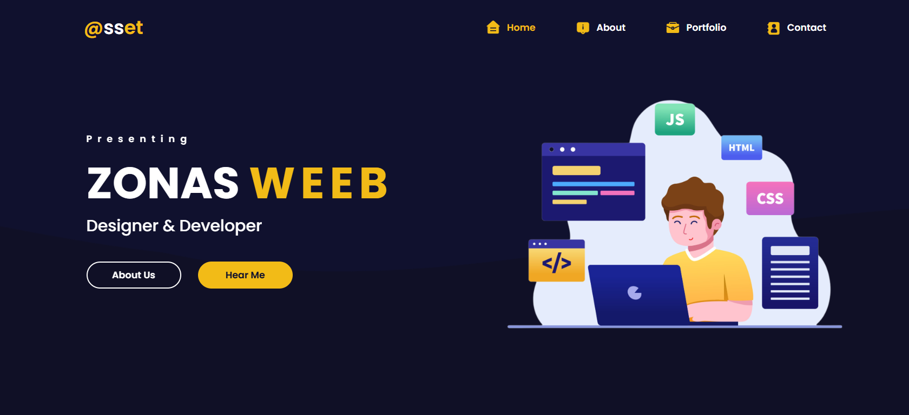
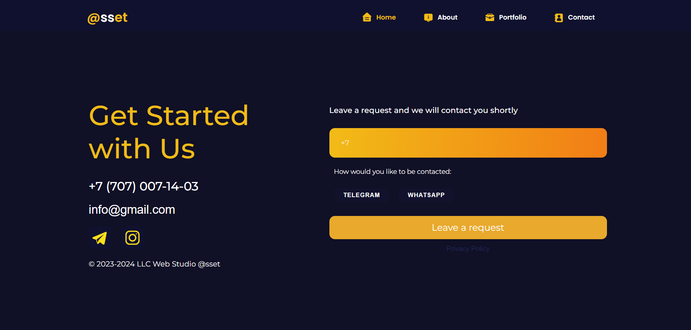

# React Portfolio Project


## 📌 Description
This is a **personal portfolio website** built with React. It showcases projects, skills, and provides a way to contact the creator. The website is **fully responsive**, interactive, and features smooth animations.

 ---
 
**GitHub Repository:** [https://github.com/MynameisM1000/React-Project-Web.git](https://github.com/MynameisM1000/React-Project-Web.git)

---

## ⚙️ Features
- Multi-page layout: **Home, About, Portfolio, Contact**
- Responsive design for mobile and desktop
- Scroll animations using **AOS (Animate On Scroll)**
- Contact form with visual feedback
- Smooth navigation with **React Router**
- Alerts and notifications using **SweetAlert**
- Clean and modern UI design

## 🛠 Technologies
- **React** – Frontend library
- **React Router** – Client-side routing
- **AOS** – Scroll animations
- **SweetAlert** – Alert notifications
- **CSS / HTML / JavaScript**

---

## 📸 Screenshots

### Hero Section


### Footer Section


---

## 🚀 Installation & Usage
1. Clone the repository:
   ```bash
   git clone https://github.com/yourusername/react-portfolio.git
